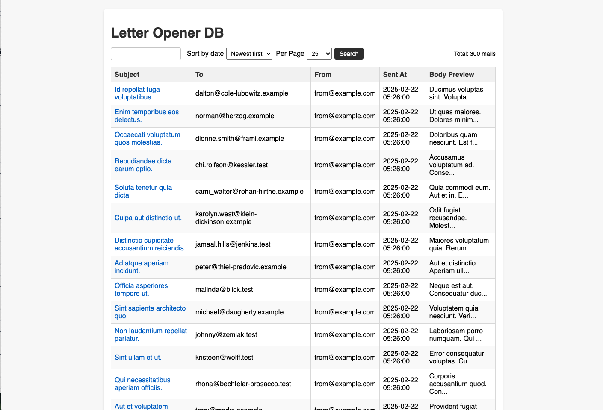

# LetterOpenerDb

**LetterOpenerDb** is a Ruby gem that intercepts outgoing emails in your Rails application and stores them in a database for easy viewing, searching, and debugging. Inspired by [letter_opener](https://github.com/ryanb/letter_opener), this gem provides a convenient web interface instead of relying on local file system storage.

## Motivation

While the original **letter_opener** gem saves emails as files, it has several limitations:

1. **No Search Functionality**: Storing emails on the file system makes them difficult to search.
2. **Server Scalability Issues**: If you run multiple servers (e.g., on a staging environment), emails are scattered across different file systems, making it impossible to view all captured emails in one place.

To address these issues, **LetterOpenerDb** saves the emails in a database, enabling:

- **Search** by subject, body, or other fields
- **Centralized Access** to all emails, even in multi-server environments

## Features

- **Database Storage**  
  All emails sent by ActionMailer are recorded in the database.
- **Web Interface**  
  Easily browse and inspect sent emails through an embedded Rails engine.
- **Simple Search**  
  Search by text in the subject or body of emails.
- **Rails Engine**  
  Includes models, controllers, and views for quick installation and easy maintenance.

## Screenshot

mail_records index


mail_records show


## Installation

Add this line to your application's Gemfile, pointing to your Git repository (private or public) or a local path:

```ruby
gem 'letter_opener_db'
```

### Then execute:

`bundle install`

### Setup

1. Migrations
   Generate and run the migrations to create the letter_opener_db_mail_records table:

```sh
rails generate letter_opener_db:install
rails db:migrate
```

2. Delivery Method
   In your config/environments/development.rb (and/or config/environments/test.rb), set:

```ruby
config.action_mailer.delivery_method = :letter_opener_db
```

3. Mount the Engine
   In your main config/routes.rb, add:

```ruby
mount LetterOpenerDb::Engine, at: '/letter_opener_db'
```

You can choose any path you prefer (e.g., '/mails').

## Usage

- Send Emails as you normally would in development or test environments.
- Access the emails at http://localhost:3000/letter_opener_db/mail_records (or your chosen mount path).
- Browse and Search
- See all captured emails, sorted by send time.
- Click on a subject to view details (recipients, subject, body, etc.).
- Use the simple search box to filter emails by subject or body text.

## Development

1. Clone or Fork the repository.
2. Edit the gem’s files in the lib and app directories as needed.
3. Test changes by running: `bundle exec rspec`

4. Optionally, add this gem as a path reference in another Rails app to test integration:

```ruby
gem 'letter_opener_db', path: '../letter_opener_db'
```

## Contributing

Contributions are welcome! To submit a feature or fix:

1. Fork this repository.
2. Create a new branch (git checkout -b feature/my-feature).
3. Commit your changes (git commit -m 'Add my feature').
4. Push the branch (git push origin feature/my-feature).
5. Open a Pull Request with a clear description of your changes.

## License

This project is released under the MIT License.
